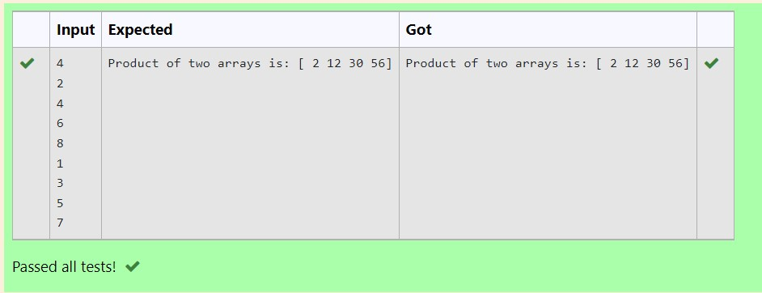

# Multiplying-two-matrix

## AIM:
To Write a python program to find multiplication of array
## ALGORITHM:

### Step 1:
import numpy module
### Step 2:
get the two array from user using for loop and append function
### Step 3:
assign the value to a variable as an array using numpy
### Step 4:
multiply the variable and assign it to another variable
### Step 5:
display the result using print() function

## PROGRAM: 
```
import numpy as np
n=int(input())
l1,l2=[],[]
for i in range(n):
    l1.append(int(input()))
for i in range(n):
    l2.append(int(input()))
A=np.array(l1)
B=np.array(l2)
result=A*B
print("Product of two arrays is:",result)
```
## OUTPUT:

## RESULT:
Thus the program is written to find multiplication of array
